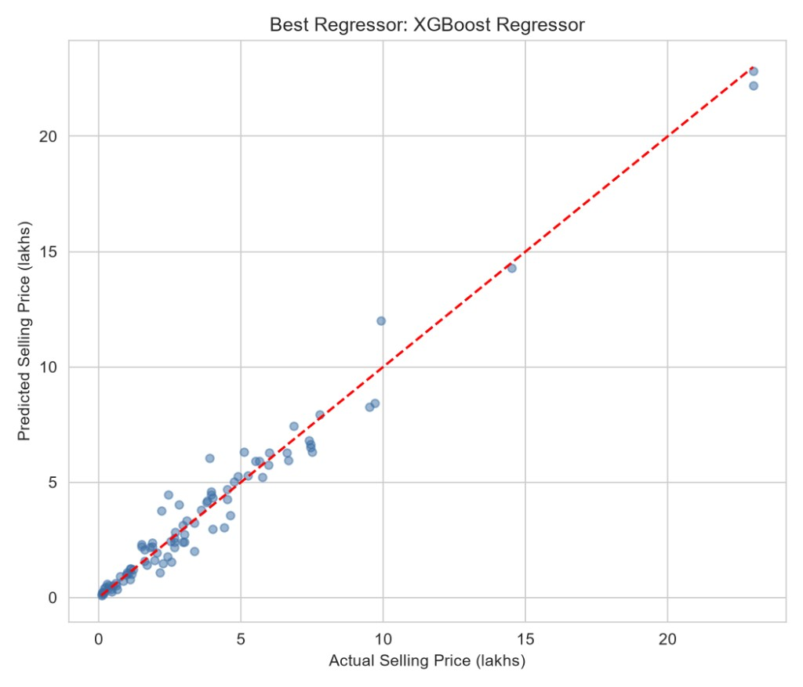
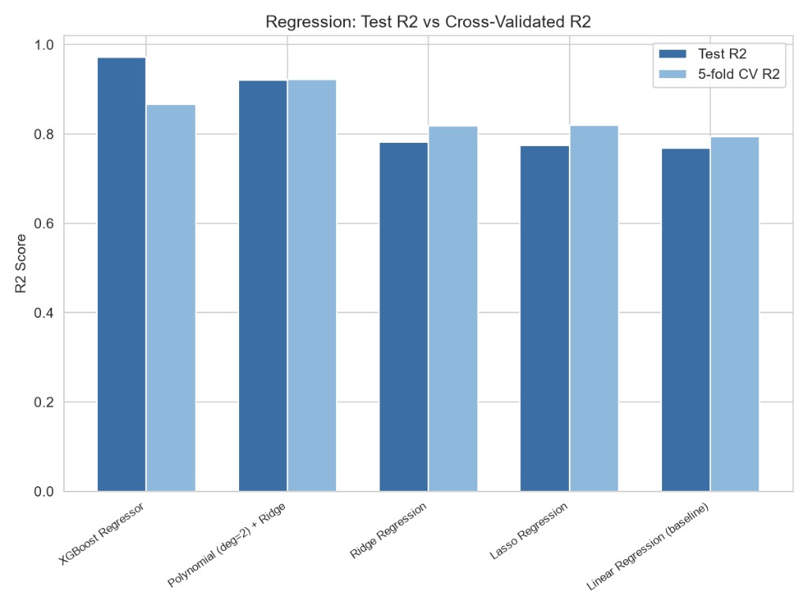
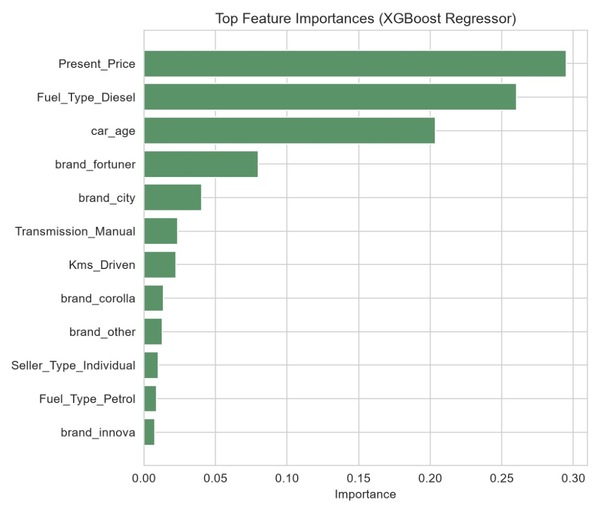
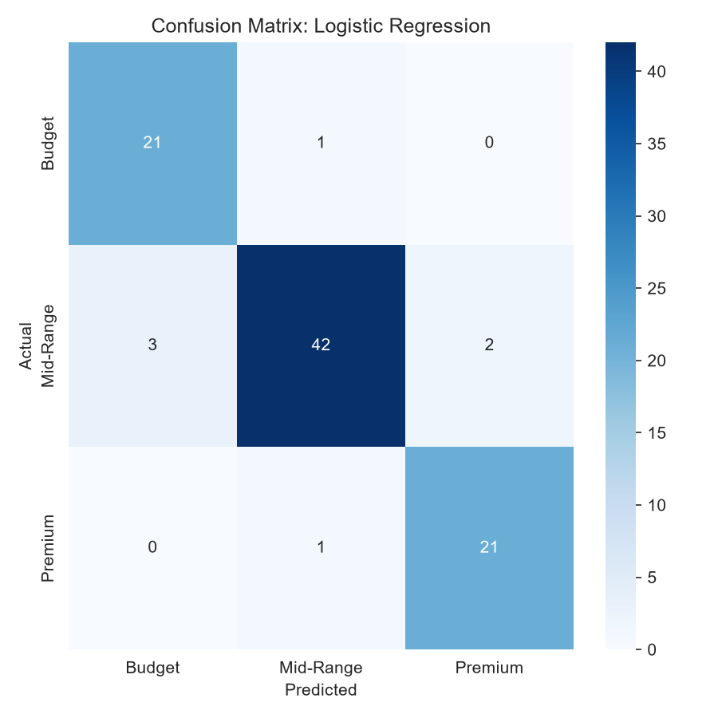
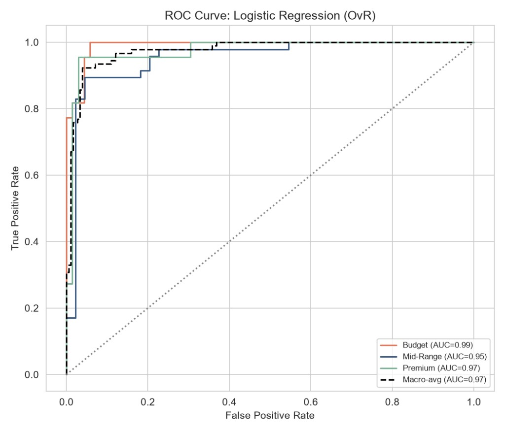
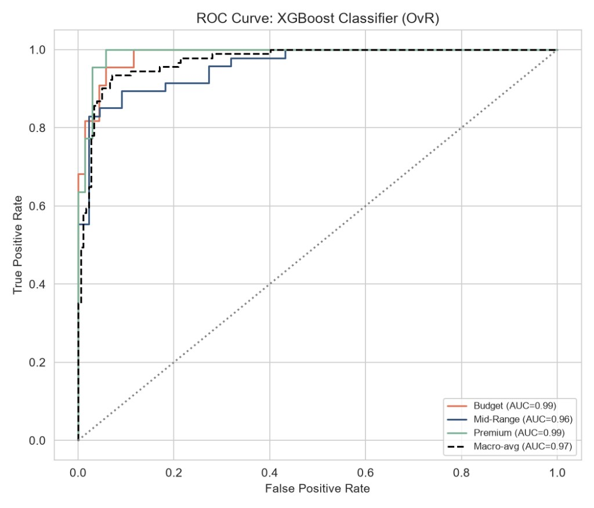

# Valuēur — ML-Powered Used Car Valuation

A full-stack machine learning web app that predicts used car resale prices in India, built end-to-end: data preprocessing, model training with hyperparameter tuning, a Flask REST API, and a live-connected frontend.

## Live Demo

🔗 *[Add your Render URL here once deployed]*

## What It Does

Enter a car's brand, model year, ex-showroom price, mileage, fuel type, transmission, and seller type — get back a real-time predicted resale value, price tier (Budget/Mid-Range/Premium), retained value %, and annual depreciation rate, all computed by a trained XGBoost regression model.

## The Data

- **Source:** 451 used car listings (CarDekho-style dataset)
- **Fields:** Car model, year, present (ex-showroom) price, kilometers driven, fuel type, seller type, transmission, ownership history, selling price
- **Feature engineering:** Car age derived from model year, brand extracted and bucketed into top-10 categories (+ "other" fallback), one-hot encoding for all categorical fields — 18 features total

## Model Performance

Five regression models and two classification models were trained and compared using 5-fold cross-validation to prevent overfitting:

| Model | Test R² | CV R² (mean ± std) |
|---|---|---|
| **XGBoost Regressor** | **0.971** | 0.866 (±0.120) |
| Polynomial (deg=2) + Ridge | 0.920 | 0.922 (±0.033) |
| Ridge Regression | 0.781 | 0.818 (±0.044) |
| Lasso Regression | 0.775 | 0.819 (±0.043) |
| Linear Regression (baseline) | 0.769 | 0.793 (±0.039) |

**Price-tier classification** (Budget / Mid-Range / Premium, via train-set quantiles):

| Model | Accuracy | Macro F1 |
|---|---|---|
| **Logistic Regression** | **92.3%** | 0.923 |
| XGBoost Classifier | 90.1% | 0.902 |

Note the gap between XGBoost's Test R² (0.971) and its cross-validated R² (0.866) — this is called out deliberately rather than hidden, since CV score is the more honest estimate of real-world performance on a small (451-row) dataset.

### Model Analysis








## Architecture

```
Browser (index.html + main.js)
        │  fetch("/predict"), fetch("/api/config")
        ▼
Flask API (app.py)
        │  loads trained model + metadata
        ▼
car_price_model.pkl · feature_cols.pkl · top_brands.pkl
```

The frontend and backend are served from the same Flask app (same-origin), so there's no hardcoded API URL — `window.location.origin` is used throughout, meaning the exact same code runs unmodified in local development and in production.

## Tech Stack

- **Model training:** scikit-learn (Linear/Ridge/Lasso/Polynomial regression, Logistic Regression), XGBoost, `GridSearchCV`/`RandomizedSearchCV` for hyperparameter tuning
- **Backend:** Flask, serving both the REST API and static frontend
- **Frontend:** Vanilla JavaScript, HTML, CSS (no framework)

## Running Locally

```bash
pip install -r requirements.txt
py train_model.py   # trains all models, saves the best one + metadata
py app.py            # starts the server
```
Then open `http://127.0.0.1:5000`.

## API Endpoints

**`GET /api/config`** — returns available brands, year range, and model performance metrics for the frontend to render.

**`POST /predict`** — accepts vehicle details as JSON, returns predicted price, tier, retention %, and depreciation rate:
```json
{
  "brand": "fortuner", "year": 2018, "presentPrice": 25.5,
  "kmsDriven": 45000, "fuel": "Diesel", "transmission": "Manual", "seller": "Dealer"
}
```

## Files in This Repo

- `train_model.py` — full training pipeline (regression + classification, 5-fold CV, hyperparameter search)
- `app.py` — Flask API server
- `index.html`, `static/` — frontend
- `car_price_model.pkl`, `feature_cols.pkl`, `top_brands.pkl` — trained model and inference metadata
- `car_data_augmented.csv` — training dataset
- `regression_results_real.csv`, `classification_results_real.csv` — full model comparison results
